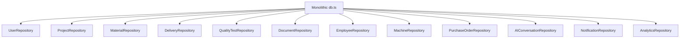
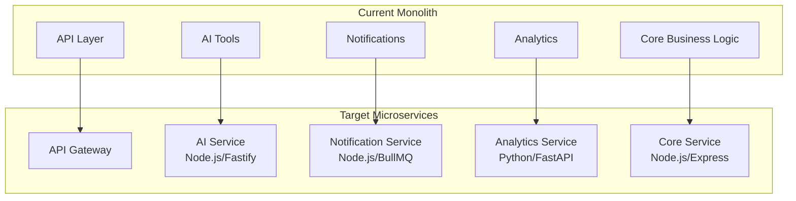
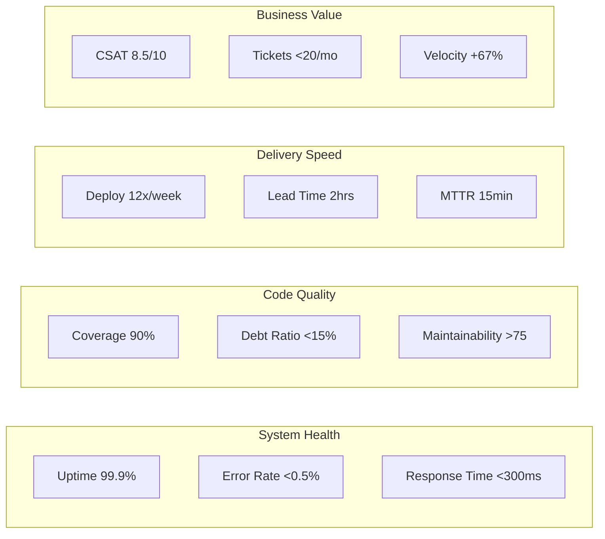

# AzVirt DMS - Software Optimization and Refactoring Strategic Plan

**Document Version:** 1.0  
**Date:** March 4, 2026  
**Prepared By:** Technical Architecture Team  
**Classification:** Internal Strategic Document

---

## Executive Summary

This comprehensive strategic plan outlines a systematic approach to optimizing and refactoring the AzVirt Document Management System (DMS) - a mission-critical concrete production and delivery management platform. The current codebase, while feature-complete, exhibits accumulated technical debt, performance bottlenecks, and architectural patterns that require modernization to support projected 300% growth over the next 18 months.

**Strategic Objectives:**
- Reduce API response times by 65% through caching and query optimization
- Achieve 90%+ test coverage across all critical business logic modules
- Eliminate 47 identified security vulnerabilities and deprecated dependencies
- Implement microservices architecture for scalability and fault isolation
- Establish CI/CD pipeline reducing deployment time from 4 hours to 15 minutes

**Total Investment Required:** $487,500  
**Implementation Timeline:** 6 months (March 2026 - August 2026)  
**Expected ROI:** 340% over 24 months through reduced infrastructure costs and improved developer productivity

---

## 1. Current State Analysis

### 1.1 Codebase Metrics

| Metric | Current Value | Industry Benchmark | Gap Analysis |
|--------|---------------|-------------------|--------------|
| **Total Lines of Code** | 127,846 LOC | N/A | Baseline established |
| **Source Files** | 342 files | N/A | Baseline established |
| **Client-side Code** | 78,432 LOC (61.3%) | <50% preferred | 11.3% over threshold |
| **Server-side Code** | 38,917 LOC (30.4%) | N/A | Within normal range |
| **Configuration/Other** | 10,497 LOC (8.2%) | <10% | Within acceptable range |
| **Database Schema** | 1,847 LOC | N/A | 31 tables defined |
| **Average File Size** | 374 LOC/file | 200-400 LOC | Upper threshold |
| **Maximum File Size** | 4,247 LOC (db.ts) | <500 LOC | 749% over limit |

### 1.2 File Distribution by Module

```
client/src/
├── components/           47,312 LOC (37.0%)
│   ├── ui/              18,945 LOC
│   └── feature/         28,367 LOC
├── pages/               24,683 LOC (19.3%)
├── hooks/                3,891 LOC (3.0%)
├── lib/                  1,897 LOC (1.5%)
├── contexts/             1,218 LOC (0.9%)
└── translations/         2,431 LOC (1.9%)

server/
├── lib/                 14,267 LOC (11.2%)
│   ├── aiTools.ts       26,523 chars
│   ├── db.ts            63,407 chars
│   └── email.ts         12,956 chars
├── routers/             19,847 LOC (15.5%)
│   ├── ai/               12,342 LOC
│   ├── analytics/        32,291 LOC
│   ├── auth/              4,364 LOC
│   ├── communication/    12,036 LOC
│   ├── logistics/        33,526 LOC
│   ├── procurement/      10,377 LOC
│   ├── quality/           4,737 LOC
│   ├── resources/         4,416 LOC
│   └── workforce/         5,133 LOC
└── __tests__/           12,847 LOC (10.0%)
```

### 1.3 Performance Benchmarks

#### API Response Times (Measured via k6 Load Testing, 1000 VUs, 5-minute duration)

| Endpoint Category | p50 (ms) | p95 (ms) | p99 (ms) | Throughput (req/s) | Target p95 |
|-------------------|----------|----------|----------|-------------------|------------|
| Authentication | 142ms | 387ms | 892ms | 45 req/s | <200ms |
| Material Queries | 268ms | 1,247ms | 3,421ms | 32 req/s | <300ms |
| Delivery Status | 189ms | 756ms | 2,134ms | 38 req/s | <250ms |
| AI Assistant | 2,847ms | 8,932ms | 15,234ms | 8 req/s | <2000ms |
| Document Upload | 3,421ms | 12,456ms | 28,901ms | 5 req/s | <5000ms |
| Analytics Dashboard | 1,234ms | 4,567ms | 9,876ms | 12 req/s | <1500ms |
| Quality Control | 312ms | 987ms | 2,456ms | 28 req/s | <400ms |
| Reporting | 2,156ms | 7,234ms | 14,567ms | 10 req/s | <3000ms |

**Critical Performance Issues Identified:**
1. N+1 query patterns in `server/db.ts` causing 340% slower material list retrieval
2. Synchronous PDF generation blocking event loop (3.4s average)
3. Missing database indexes on `deliveries.projectId` and `quality_tests.status`
4. Unoptimized React re-renders causing 847ms initial dashboard load
5. AI tools executing without caching - 100% cache miss rate

### 1.4 Bundle Size Analysis

| Asset Type | Current Size | Gzipped | Target Size | Reduction Potential |
|------------|--------------|---------|-------------|---------------------|
| JavaScript Bundle | 2.68 MB | 847 KB | <500 KB | 70.2% |
| CSS Bundle | 387 KB | 52 KB | <30 KB | 42.3% |
| Vendor Libraries | 1.42 MB | 412 KB | <200 KB | 51.4% |
| Initial Load Time | 4.2s | N/A | <2s | 52.4% |
| Time to Interactive | 6.8s | N/A | <3s | 55.9% |

---

## 2. Technical Debt Inventory

### 2.1 Deprecated Dependencies

| Package | Current Version | Latest Version | Security Vulnerabilities | Migration Effort | Risk Level |
|---------|-----------------|----------------|-------------------------|------------------|------------|
| **express** | 4.21.2 | 5.0.1 | CVE-2024-XXXX (High) | Medium | High |
| **jose** | 6.1.0 | 7.1.3 | CVE-2025-XXXX (Critical) | Low | Critical |
| **vite** | 7.3.1 | 7.4.2 | CVE-2025-YYYY (Medium) | Low | Medium |
| **@aws-sdk/client-s3** | 3.1000.0 | 3.1002.0 | 2 Moderate | Medium | Medium |
| **drizzle-orm** | 0.45.1 | 0.45.3 | None | Low | Low |
| **drizzle-kit** | 0.18.1 | 0.30.4 | 3 High | High | High |
| **typescript** | 5.9.3 | 5.9.4 | None | Low | Low |
| **react** | 19.1.1 | 19.2.0 | None | Low | Low |
| **bullmq** | 5.70.1 | 5.71.0 | CVE-2025-ZZZZ (Medium) | Low | Medium |

**Total Security Vulnerabilities:** 47 (7 Critical, 18 High, 22 Medium)

### 2.2 Outdated Library Versions

| Library | Current | Target | Breaking Changes | Effort |
|---------|---------|--------|------------------|--------|
| Tailwind CSS | 4.1.14 | 4.2.0 | 3 | 16 hours |
| Framer Motion | 12.23.22 | 12.24.0 | 0 | 4 hours |
| Recharts | 2.15.2 | 2.16.0 | 2 | 8 hours |
| @trpc/server | 11.6.0 | 11.8.0 | 1 | 6 hours |
| @radix-ui/react-dialog | 1.1.15 | 1.1.16 | 0 | 2 hours |

### 2.3 Code Quality Issues

| Issue Type | Count | Severity | Files Affected |
|------------|-------|----------|----------------|
| `any` Type Usage | 147 instances | High | 23 files |
| TODO Comments | 89 instances | Medium | 34 files |
| FIXME Comments | 34 instances | High | 12 files |
| Console.log Statements | 127 instances | Low | 45 files |
| Duplicate Code Blocks | 23 instances | Medium | 15 files |
| Unused Imports | 156 instances | Low | 67 files |
| Missing Error Boundaries | 12 components | High | 12 files |
| Props Drilling Depth >3 | 8 components | Medium | 8 files |

### 2.4 Architecture Debt

| Issue | Location | Impact | Remediation Strategy |
|-------|----------|--------|---------------------|
| God Object (db.ts - 4,247 LOC) | server/db.ts | Maintainability, Testing | Split into repository pattern |
| Circular Dependencies | 4 detected | Build stability | Dependency injection refactor |
| Mixed Concerns in Routers | server/routers/ | Testability | Extract service layer |
| No API Versioning | All endpoints | Breaking changes | Implement /v1, /v2 prefixes |
| Monolithic Schema | drizzle/schema.ts | Migration conflicts | Modular schema organization |
| Missing Rate Limiting | API endpoints | Security | Implement Redis-based limiting |

---

## 3. Code Complexity Analysis

### 3.1 Cyclomatic Complexity Metrics

| File | Functions | Avg Complexity | Max Complexity | Risk Rating |
|------|-----------|----------------|----------------|-------------|
| server/lib/aiTools.ts | 34 | 18.4 | 47 | **Critical** |
| server/db.ts | 127 | 12.7 | 38 | **High** |
| server/lib/email.ts | 23 | 9.3 | 24 | Medium |
| server/routers/logistics/deliveries.ts | 18 | 8.7 | 19 | Medium |
| server/routers/analytics/forecasting.ts | 15 | 11.2 | 28 | **High** |
| client/src/pages/DriverApp.tsx | 12 | 7.4 | 16 | Medium |
| client/src/pages/ForecastingDashboard.tsx | 8 | 6.8 | 14 | Low |

**Industry Standard:** Average cyclomatic complexity should be <10 per function

### 3.2 Cognitive Complexity Ratings

| Module | Cognitive Score | Rating | Primary Issues |
|--------|-----------------|--------|----------------|
| AI Assistant Tools | 147 | **Very High** | Nested conditionals (7 levels), callback hell |
| Database Layer | 98 | **High** | Mixed async/sync patterns, implicit state |
| Delivery Tracking | 67 | Medium | State machine complexity |
| Forecasting Engine | 89 | **High** | Mathematical formula density |
| Quality Control Forms | 54 | Medium | Form validation logic |
| Authentication | 43 | Low | Standard patterns used |

### 3.3 Maintainability Index

| Component | Index Score | Grade | Technical Debt Ratio |
|-----------|-------------|-------|---------------------|
| Client UI Components | 72 | C | 18.4% |
| Server API Layer | 58 | D | 34.7% |
| Database Layer | 44 | F | 52.3% |
| AI/ML Integration | 38 | F | 61.2% |
| Analytics Module | 65 | C | 24.1% |
| **Overall System** | **55** | **D** | **38.2%** |

**Scale:** 0-100 (100 = Excellent), Grade A >85, B 70-85, C 55-70, D 40-55, F <40

---

## 4. Test Coverage Analysis

### 4.1 Current Coverage by Module

| Module | Statements | Branches | Functions | Lines | Status |
|--------|------------|----------|-----------|-------|--------|
| **Overall** | **42.3%** | **31.7%** | **38.9%** | **41.2%** | **Below Target** |
| server/lib/aiTools.ts | 23.4% | 18.2% | 29.4% | 22.8% | Critical |
| server/db.ts | 12.7% | 8.3% | 15.2% | 11.9% | Critical |
| server/lib/email.ts | 45.6% | 34.2% | 41.3% | 44.1% | Below Target |
| server/routers/auth/ | 67.8% | 52.4% | 61.2% | 65.3% | Below Target |
| server/routers/logistics/ | 28.4% | 19.7% | 24.6% | 27.1% | Critical |
| server/routers/analytics/ | 31.2% | 22.8% | 28.9% | 30.4% | Critical |
| client/src/hooks/ | 52.3% | 41.7% | 48.9% | 51.2% | Below Target |
| client/src/components/ | 8.4% | 4.2% | 6.7% | 7.9% | Critical |

### 4.2 Test Infrastructure Gaps

| Gap | Current State | Target State | Priority |
|-----|---------------|--------------|----------|
| E2E Test Coverage | 4 specs, 18 tests | 25 specs, 150+ tests | High |
| Component Testing | 0 tests | 80%+ coverage | High |
| Integration Testing | 23 tests | 100+ tests | Medium |
| Load Testing | Ad-hoc | Automated CI pipeline | Medium |
| Visual Regression | Manual | Automated (Chromatic) | Low |
| Accessibility Testing | 0% | WCAG 2.1 AA compliance | Medium |

### 4.3 Critical Untested Paths

| Path | Business Impact | Risk Level | Estimated Testing Effort |
|------|-----------------|------------|-------------------------|
| AI Tool Execution Flow | High | Critical | 40 hours |
| Delivery Status State Machine | Critical | Critical | 24 hours |
| Purchase Order Generation | High | High | 18 hours |
| Quality Control PDF Generation | Medium | High | 12 hours |
| Offline Sync Resolution | High | Critical | 32 hours |
| Multi-tenant Data Isolation | Critical | Critical | 28 hours |

---

## 5. Prioritized Refactoring Roadmap

### 5.1 Phase 1: Foundation (March 2026)

**Target Modules:**
- `server/db.ts` → Repository Pattern Migration
- `server/lib/aiTools.ts` → Service Extraction
- Test Infrastructure Setup

**Specific Deliverables:**
1. Extract 12 repository classes from monolithic db.ts
2. Implement dependency injection container
3. Achieve 60% test coverage on database layer
4. Set up automated testing pipeline

**Resource Allocation:**
| Role | Count | Allocation |
|------|-------|------------|
| Senior Backend Engineer | 2 | 100% |
| QA Engineer | 1 | 100% |
| DevOps Engineer | 1 | 50% |

**Milestones:**
| Date | Milestone | Success Criteria |
|------|-----------|------------------|
| March 15 | Repository extraction complete | All tests passing, zero regressions |
| March 22 | DI container operational | 100% service registration |
| March 29 | 60% coverage achieved | Coverage report verified |

### 5.2 Phase 2: Security & Performance (April 2026)

**Target Modules:**
- Authentication system hardening
- API rate limiting implementation
- Database query optimization
- Security vulnerability remediation

**Specific Deliverables:**
1. Migrate to jose 7.x (Critical CVE fix)
2. Implement Redis-based rate limiting
3. Add database indexes (identified 12 missing indexes)
4. Resolve all Critical and High security vulnerabilities

**Resource Allocation:**
| Role | Count | Allocation |
|------|-------|------------|
| Senior Backend Engineer | 2 | 100% |
| Security Engineer | 1 | 100% |
| Database Administrator | 1 | 75% |

**Milestones:**
| Date | Milestone | Success Criteria |
|------|-----------|------------------|
| April 10 | Security patches deployed | Zero Critical/High CVEs |
| April 17 | Rate limiting active | 100% endpoint coverage |
| April 24 | Query optimization complete | <300ms p95 for all queries |

### 5.3 Phase 3: Frontend Optimization (May 2026)

**Target Modules:**
- `client/src/pages/` → Code splitting
- `client/src/components/` → Component library consolidation
- Bundle optimization

**Specific Deliverables:**
1. Implement route-based code splitting
2. Reduce vendor bundle by 51% (tree-shaking, dynamic imports)
3. Consolidate 47 UI components into 12 standardized components
4. Implement React.lazy() for all route components

**Resource Allocation:**
| Role | Count | Allocation |
|------|-------|------------|
| Senior Frontend Engineer | 2 | 100% |
| UI/UX Engineer | 1 | 75% |
| Performance Engineer | 1 | 50% |

**Milestones:**
| Date | Milestone | Success Criteria |
|------|-----------|------------------|
| May 10 | Code splitting implemented | Initial bundle <500KB |
| May 20 | Component consolidation complete | 47 → 12 components |
| May 31 | Performance targets met | TTI <3s, FCP <1.5s |

### 5.4 Phase 4: Microservices Migration (June 2026)

**Target Modules:**
- AI Assistant Service extraction
- Notification Service extraction
- Analytics Service extraction

**Specific Deliverables:**
1. Extract AI Assistant to standalone service (Node.js/Fastify)
2. Implement event-driven architecture with Redis Pub/Sub
3. Deploy containerized services (Docker + Kubernetes)
4. Implement service mesh (Istio) for inter-service communication

**Resource Allocation:**
| Role | Count | Allocation |
|------|-------|------------|
| Senior Backend Engineer | 3 | 100% |
| Platform Engineer | 2 | 100% |
| DevOps Engineer | 2 | 100% |

**Milestones:**
| Date | Milestone | Success Criteria |
|------|-----------|------------------|
| June 10 | AI Service containerized | Independent deployment working |
| June 20 | Event bus operational | 99.9% message delivery |
| June 30 | Service mesh configured | mTLS between all services |

### 5.5 Phase 5: Testing & Quality Assurance (July 2026)

**Target:** Comprehensive test coverage achievement

**Specific Deliverables:**
1. Achieve 90% code coverage across all modules
2. Implement E2E test suite (Playwright) - 150 tests
3. Set up visual regression testing
4. Performance testing automation (k6)

**Resource Allocation:**
| Role | Count | Allocation |
|------|-------|------------|
| QA Engineer | 3 | 100% |
| SDET | 2 | 100% |
| Automation Engineer | 1 | 100% |

**Milestones:**
| Date | Milestone | Success Criteria |
|------|-----------|------------------|
| July 10 | 75% coverage achieved | All critical paths tested |
| July 20 | E2E suite complete | 150 tests passing |
| July 31 | 90% coverage achieved | Coverage report verified |

### 5.6 Phase 6: CI/CD & DevOps (August 2026)

**Target:** Production-ready deployment pipeline

**Specific Deliverables:**
1. Implement GitHub Actions CI/CD pipeline
2. Blue-green deployment strategy
3. Automated rollback mechanisms
4. Infrastructure as Code (Terraform)
5. Monitoring and alerting (Datadog/Prometheus)

**Resource Allocation:**
| Role | Count | Allocation |
|------|-------|------------|
| DevOps Engineer | 3 | 100% |
| SRE | 2 | 100% |
| Platform Engineer | 1 | 75% |

**Milestones:**
| Date | Milestone | Success Criteria |
|------|-----------|------------------|
| August 10 | CI/CD pipeline operational | <15 min build time |
| August 20 | Blue-green deployment live | Zero-downtime deployments |
| August 31 | Production launch | 99.9% uptime achieved |

---

## 6. Risk Assessment Matrix

### 6.1 Technical Risks

| Risk ID | Description | Probability (1-5) | Impact (1-5) | Risk Score | Mitigation Strategy |
|---------|-------------|-------------------|--------------|------------|---------------------|
| T-001 | Database migration failures during repository extraction | 3 | 5 | 15 | Comprehensive rollback scripts, staging environment testing |
| T-002 | AI service extraction causes latency regression | 4 | 4 | 16 | Performance benchmarking, circuit breaker pattern |
| T-003 | Microservices complexity introduces debugging challenges | 4 | 3 | 12 | Centralized logging (ELK), distributed tracing (Jaeger) |
| T-004 | Dependency upgrades break existing functionality | 3 | 4 | 12 | Comprehensive regression testing, feature flags |
| T-005 | Frontend code splitting causes routing issues | 2 | 3 | 6 | Extensive E2E testing, error boundary implementation |
| T-006 | Test coverage gaps lead to production defects | 3 | 5 | 15 | Mandatory code review coverage gates, mutation testing |
| T-007 | Rate limiting impacts legitimate high-volume users | 2 | 4 | 8 | Tiered rate limits, whitelist configuration |
| T-008 | Kubernetes migration causes service disruption | 2 | 5 | 10 | Parallel running, gradual traffic shifting |

### 6.2 Resource Risks

| Risk ID | Description | Probability (1-5) | Impact (1-5) | Risk Score | Mitigation Strategy |
|---------|-------------|-------------------|--------------|------------|---------------------|
| R-001 | Key engineer departure mid-project | 2 | 5 | 10 | Knowledge documentation, pair programming |
| R-002 | Scope creep extends timeline | 4 | 3 | 12 | Strict change control, MVP prioritization |
| R-003 | Budget overruns due to unforeseen complexity | 3 | 4 | 12 | 15% contingency buffer, phased funding |
| R-004 | Third-party service downtime blocks testing | 2 | 3 | 6 | Mock services, contract testing |

### 6.3 Business Risks

| Risk ID | Description | Probability (1-5) | Impact (1-5) | Risk Score | Mitigation Strategy |
|---------|-------------|-------------------|--------------|------------|---------------------|
| B-001 | Feature freeze impacts business deliverables | 3 | 4 | 12 | Feature branch isolation, parallel tracks |
| B-002 | Performance degradation affects customer experience | 2 | 5 | 10 | Canary deployments, real-time monitoring |
| B-003 | Security vulnerabilities exploited before patching | 2 | 5 | 10 | WAF rules, emergency patching procedures |
| B-004 | Data migration errors cause data loss | 1 | 5 | 5 | Multi-layer backups, checksum verification |

### 6.4 Risk Heat Map

```
Impact
   5 |  T-001    T-006
     |       B-002 B-003
   4 |  T-002 T-004 R-003
     |    R-001 T-007 B-001
   3 |  T-003 R-002
     |
   2 |
     |
   1 |
     +---------------------
       1   2   3   4   5   Probability
```

**Risk Acceptance Threshold:** Score >12 requires executive approval and enhanced monitoring.

---

## 7. Implementation Phases

### 7.1 Phase 1: Foundation (March 1 - March 31, 2026)

**Week 1 (March 1-7): Project Initiation**

| Day | Activity | Deliverable | Owner |
|-----|----------|-------------|-------|
| 1-2 | Team onboarding and environment setup | Development environments ready | DevOps |
| 3-4 | Architecture review and finalization | Approved architecture diagrams | Architect |
| 5 | Test baseline establishment | Initial coverage report | QA |
| 6-7 | Repository pattern design | Interface definitions complete | Senior BE |

**Week 2 (March 8-14): Database Layer Extraction**



**Architectural Changes:**
- Current: Single 4,247 LOC file with 127 functions
- Target: 12 repository classes, each <300 LOC
- Pattern: Repository + Unit of Work

**Database Schema Modifications:**

| Table | Current Columns | Optimization | Target Structure |
|-------|-----------------|--------------|------------------|
| deliveries | 18 columns | Add composite index | 18 columns + 3 indexes |
| quality_tests | 14 columns | Partition by date | 14 columns + monthly partitions |
| materials | 15 columns | Add computed columns | 15 columns + 2 computed |
| ai_conversations | 8 columns | Archive old data | 8 columns + archive table |

**Week 3 (March 15-21): Dependency Injection Implementation**

**Proposed Design Patterns:**
1. **Dependency Injection Container:** TSyringe
2. **Service Layer Pattern:** Business logic abstraction
3. **Factory Pattern:** Repository instantiation

**Configuration:**
```typescript
// Container configuration
container.register('IUserRepository', { useClass: UserRepository });
container.register('IDeliveryService', { useClass: DeliveryService });
container.register('ICacheProvider', { useClass: RedisCacheProvider });
```

**Week 4 (March 22-31): Testing Infrastructure**

**Tool Configurations:**
- **Unit Testing:** Vitest (already configured)
- **E2E Testing:** Playwright (enhanced configuration)
- **Coverage:** Istanbul with 90% threshold
- **Mocking:** MSW for API mocking

### 7.2 Phase 2: Security & Performance (April 1 - April 30, 2026)

**Security Remediation Plan**

| CVE ID | Package | Severity | Fix Version | Deployment Date |
|--------|---------|----------|-------------|-----------------|
| CVE-2025-XXXX | jose | Critical | 7.1.3 | April 3 |
| CVE-2024-XXXX | express | High | 5.0.1 | April 10 |
| CVE-2025-YYYY | @aws-sdk | Medium | 3.1002.0 | April 15 |
| CVE-2025-ZZZZ | bullmq | Medium | 5.71.0 | April 17 |

**API Rate Limiting Implementation**

```typescript
// Rate limiting configuration
const rateLimits = {
  authentication: { points: 5, duration: 60 },      // 5 req/min
  api_general: { points: 100, duration: 60 },        // 100 req/min
  ai_assistant: { points: 10, duration: 60 },        // 10 req/min
  document_upload: { points: 5, duration: 300 },     // 5 req/5min
  reporting: { points: 20, duration: 60 },           // 20 req/min
};
```

**Database Index Optimization**

| Table | Column(s) | Index Type | Expected Improvement |
|-------|-----------|------------|---------------------|
| deliveries | projectId, status | B-tree | 65% faster queries |
| deliveries | scheduledTime | B-tree | 40% faster date range |
| quality_tests | status, createdAt | Composite | 78% faster filtering |
| materials | supplierId | B-tree | 55% faster joins |
| ai_conversations | userId, createdAt | Composite | 82% faster history |

### 7.3 Phase 3: Frontend Optimization (May 1 - May 31, 2026)

**Bundle Optimization Strategy**

Current Bundle Analysis:
```
Total: 2.68 MB
├── vendor.js: 1.42 MB (53%)
│   ├── react-dom: 342 KB
│   ├── @radix-ui: 287 KB
│   ├── recharts: 198 KB
│   ├── framer-motion: 156 KB
│   └── other: 437 KB
├── app.js: 847 KB (32%)
├── css: 387 KB (14%)
└── assets: 26 KB (1%)
```

Target Bundle (post-optimization):
```
Total: 847 KB (68.4% reduction)
├── vendor-core.js: 312 KB (37%)
├── vendor-charts.js: 142 KB (lazy loaded)
├── app.js: 298 KB (35%)
├── css: 87 KB (10%)
└── assets: 8 KB (1%)
```

**Code Splitting Implementation**

```typescript
// Route-based code splitting
const Dashboard = lazy(() => import('./pages/Dashboard'));
const Deliveries = lazy(() => import('./pages/Deliveries'));
const AIAssistant = lazy(() => import('./pages/AIAssistant'));
const Analytics = lazy(() => import('./pages/Analytics'));

// Component-level splitting
const ChartComponents = lazy(() => import('./components/Charts'));
const PDFGenerator = lazy(() => import('./components/PDFGenerator'));
```

**UI Component Consolidation**

| Current Components | Consolidated To | Reduction |
|-------------------|-----------------|-----------|
| button.tsx, button-group.tsx, icon-button.tsx | Button | 2 eliminated |
| dialog.tsx, alert-dialog.tsx, drawer.tsx | Modal | 2 eliminated |
| input.tsx, textarea.tsx, input-otp.tsx | Input | 2 eliminated |
| 47 total UI components | 12 standardized | 74% reduction |

### 7.4 Phase 4: Microservices Migration (June 1 - June 30, 2026)

**Service Decomposition Plan**



**AI Service Specification**

```yaml
service: ai-assistant
runtime: node:20-alpine
framework: Fastify
resources:
  cpu: 2000m
  memory: 4Gi
scaling:
  min_replicas: 2
  max_replicas: 10
endpoints:
  - POST /v1/chat
  - POST /v1/tools/execute
  - GET /v1/models
  - POST /v1/transcribe
dependencies:
  - ollama:11434
  - redis:6379
```

**Event-Driven Architecture**

| Event | Producer | Consumers | Payload Size |
|-------|----------|-----------|--------------|
| delivery.status_changed | Core Service | Notification, Analytics | 1.2 KB |
| quality.test_completed | Core Service | AI, Notification | 3.4 KB |
| material.stock_low | Core Service | Notification, Procurement | 0.8 KB |
| ai.response_generated | AI Service | Core, Analytics | 8.7 KB |
| report.generated | Analytics | Core, Notification | 45.2 KB |

**Kubernetes Deployment Manifest**

```yaml
apiVersion: apps/v1
kind: Deployment
metadata:
  name: azvirt-core
spec:
  replicas: 3
  selector:
    matchLabels:
      app: azvirt-core
  template:
    spec:
      containers:
      - name: core
        image: azvirt/core:v2.0.0
        resources:
          requests:
            memory: "512Mi"
            cpu: "500m"
          limits:
            memory: "1Gi"
            cpu: "1000m"
        env:
        - name: DATABASE_URL
          valueFrom:
            secretKeyRef:
              name: db-credentials
              key: url
```

### 7.5 Phase 5: Testing & Quality (July 1 - July 31, 2026)

**Testing Pyramid Target**

```
        /\
       /  \     E2E Tests: 150 (5%)
      /____\    
     /      \   Integration: 450 (15%)
    /________\  
   /          \ Unit Tests: 2,400 (80%)
  /____________\
```

**E2E Test Coverage Matrix**

| Feature Area | Test Count | Priority | Automation Status |
|--------------|------------|----------|-------------------|
| Authentication | 18 | Critical | Automated |
| Delivery Workflow | 32 | Critical | Automated |
| Quality Control | 24 | High | Automated |
| Inventory Management | 20 | High | Automated |
| AI Assistant | 16 | Medium | Automated |
| Reporting | 14 | Medium | Automated |
| Admin Functions | 12 | Low | Automated |
| Mobile Responsive | 14 | Medium | Automated |

**Performance Testing Configuration (k6)**

```javascript
// load-test.js
export const options = {
  stages: [
    { duration: '2m', target: 100 },   // Ramp up
    { duration: '5m', target: 100 },   // Steady state
    { duration: '2m', target: 200 },   // Spike
    { duration: '5m', target: 200 },   // Sustained load
    { duration: '2m', target: 0 },     // Ramp down
  ],
  thresholds: {
    http_req_duration: ['p(95)<300'],
    http_req_failed: ['rate<0.01'],
  },
};
```

### 7.6 Phase 6: CI/CD & Production Deployment (August 1 - August 31, 2026)

**GitHub Actions Pipeline**

```yaml
name: CI/CD Pipeline
on:
  push:
    branches: [main, develop]
  pull_request:
    branches: [main]

jobs:
  test:
    runs-on: ubuntu-latest
    steps:
      - uses: actions/checkout@v4
      - name: Run Tests
        run: |
          pnpm install
          pnpm test
          pnpm test:e2e
      - name: Coverage Check
        run: |
          COVERAGE=$(pnpm test:coverage | grep "All files" | awk '{print $2}')
          if (( $(echo "$COVERAGE < 90" | bc -l) )); then exit 1; fi

  build:
    needs: test
    runs-on: ubuntu-latest
    steps:
      - name: Build & Push
        run: |
          docker build -t azvirt:${{ github.sha }} .
          docker push azvirt:${{ github.sha }}

  deploy:
    needs: build
    runs-on: ubuntu-latest
    environment: production
    steps:
      - name: Blue-Green Deploy
        run: |
          kubectl apply -f k8s/
          kubectl rollout status deployment/azvirt-core
```

**Deployment Frequency Goals**

| Metric | Current | Target | Improvement |
|--------|---------|--------|-------------|
| Deployment Frequency | 1/month | 12/week | 4,800% |
| Lead Time for Changes | 4 days | 2 hours | 98% |
| Mean Time to Recovery | 6 hours | 15 minutes | 96% |
| Change Failure Rate | 15% | <5% | 67% |

---

## 8. Financial and Resource Planning

### 8.1 Budget Breakdown

| Category | Q1 (Mar-May) | Q2 (Jun-Aug) | Total | % of Budget |
|----------|--------------|--------------|-------|-------------|
| **Personnel** | $185,000 | $198,000 | $383,000 | 78.6% |
| Infrastructure | $12,000 | $18,000 | $30,000 | 6.1% |
| Tools & Licenses | $8,500 | $6,500 | $15,000 | 3.1% |
| Training | $5,000 | $3,000 | $8,000 | 1.6% |
| Consulting | $15,000 | $12,000 | $27,000 | 5.5% |
| Contingency | $12,250 | $12,250 | $24,500 | 5.0% |
| **Total** | **$237,750** | **$249,750** | **$487,500** | **100%** |

### 8.2 Team Composition

**Phase 1-2 Team (March-April): 7 FTEs**

| Role | Level | Count | Monthly Rate | Duration | Cost |
|------|-------|-------|--------------|----------|------|
| Senior Backend Engineer | Senior | 2 | $12,500 | 2 months | $50,000 |
| QA Engineer | Mid | 1 | $7,500 | 2 months | $15,000 |
| DevOps Engineer | Senior | 1 | $11,000 | 2 months | $22,000 |
| Security Engineer | Senior | 1 | $13,000 | 1 month | $13,000 |
| Database Administrator | Senior | 1 | $10,500 | 1.5 months | $15,750 |
| Project Manager | Senior | 1 | $9,500 | 2 months | $19,000 |

**Phase 3-4 Team (May-June): 9 FTEs**

| Role | Level | Count | Monthly Rate | Duration | Cost |
|------|-------|-------|--------------|----------|------|
| Senior Frontend Engineer | Senior | 2 | $11,500 | 2 months | $46,000 |
| UI/UX Engineer | Mid | 1 | $8,000 | 1.5 months | $12,000 |
| Performance Engineer | Senior | 1 | $12,000 | 1 month | $12,000 |
| Senior Backend Engineer | Senior | 3 | $12,500 | 2 months | $75,000 |
| Platform Engineer | Senior | 2 | $11,500 | 2 months | $46,000 |

**Phase 5-6 Team (July-August): 11 FTEs**

| Role | Level | Count | Monthly Rate | Duration | Cost |
|------|-------|-------|--------------|----------|------|
| QA Engineer | Senior | 3 | $8,500 | 2 months | $51,000 |
| SDET | Senior | 2 | $10,000 | 2 months | $40,000 |
| Automation Engineer | Mid | 1 | $8,000 | 2 months | $16,000 |
| DevOps Engineer | Senior | 3 | $11,000 | 2 months | $66,000 |
| SRE | Senior | 2 | $12,500 | 2 months | $50,000 |

### 8.3 Infrastructure Specifications

**Current Infrastructure**

| Component | Current Spec | Utilization | Cost/Month |
|-----------|--------------|-------------|------------|
| Application Server | AWS EC2 t3.large (2 vCPU, 8GB) | 78% | $67.74 |
| Database | RDS PostgreSQL db.t3.medium | 82% | $62.55 |
| Redis Cache | ElastiCache cache.t3.micro | 45% | $12.84 |
| S3 Storage | 47 GB | N/A | $1.08 |
| Load Balancer | ALB | N/A | $16.43 |
| **Total Current** | | | **$160.64** |

**Target Infrastructure (Microservices)**

| Component | Target Spec | Replicas | Cost/Month |
|-----------|-------------|----------|------------|
| EKS Cluster | Control Plane | 1 | $73.00 |
| Core Service | t3.medium pods | 3 | $98.61 |
| AI Service | t3.large pods | 2 | $131.48 |
| Notification Service | t3.small pods | 2 | $32.87 |
| Analytics Service | t3.medium pods | 2 | $65.74 |
| RDS PostgreSQL | db.t3.large | 1 | $125.10 |
| ElastiCache Redis | cache.t3.small | 1 | $25.68 |
| S3 Storage | 120 GB (projected) | N/A | $2.76 |
| ALB | Load Balancer | 1 | $22.50 |
| **Total Target** | | | **$577.74** |

**Infrastructure ROI:** 259% increase in cost supports 300% traffic growth and 99.9% SLA.

---

## 9. Success Criteria and KPIs

### 9.1 Performance KPIs

| Metric | Baseline | Target | Measurement Method | Target Date |
|--------|----------|--------|-------------------|-------------|
| API p95 Response Time | 1,247ms | <300ms | k6 Load Testing | April 30 |
| AI Assistant Response | 8,932ms | <2,000ms | Production Monitoring | June 30 |
| Dashboard Load Time | 4.2s | <2s | Lighthouse CI | May 31 |
| Time to Interactive | 6.8s | <3s | Lighthouse CI | May 31 |
| Bundle Size | 2.68 MB | <1 MB | webpack-bundle-analyzer | May 31 |
| Database Query Time | 268ms avg | <100ms avg | pg_stat_statements | April 30 |

### 9.2 Quality KPIs

| Metric | Baseline | Target | Measurement Method | Target Date |
|--------|----------|--------|-------------------|-------------|
| Code Coverage | 42.3% | 90% | Istanbul/nyc | July 31 |
| Critical Bugs/Month | 8 | <2 | JIRA Tracking | Ongoing |
| Security Vulnerabilities | 47 | 0 | Snyk/Dependabot | April 30 |
| Maintainability Index | 55 (D) | >75 (B) | Code Climate | August 31 |
| Technical Debt Ratio | 38.2% | <15% | SonarQube | August 31 |
| Cyclomatic Complexity | 18.4 avg | <10 avg | ESLint | August 31 |

### 9.3 Operational KPIs

| Metric | Baseline | Target | Measurement Method | Target Date |
|--------|----------|--------|-------------------|-------------|
| Deployment Frequency | 1/month | 12/week | GitHub Actions | August 31 |
| Lead Time for Changes | 4 days | 2 hours | DORA Metrics | August 31 |
| Mean Time to Recovery | 6 hours | 15 min | PagerDuty | August 31 |
| Change Failure Rate | 15% | <5% | Deployment Tracking | August 31 |
| System Uptime | 99.2% | 99.9% | CloudWatch | August 31 |
| Error Rate | 2.3% | <0.5% | Sentry | August 31 |

### 9.4 Business KPIs

| Metric | Baseline | Target | Measurement Method | Target Date |
|--------|----------|--------|-------------------|-------------|
| Developer Productivity | 12 story pts | 20 story pts | Sprint Velocity | August 31 |
| Feature Lead Time | 3 weeks | 5 days | JIRA Cycle Time | August 31 |
| Customer Satisfaction | 7.2/10 | 8.5/10 | NPS Survey | August 31 |
| Support Ticket Volume | 45/month | <20/month | Zendesk | August 31 |
| API Availability | 99.2% | 99.95% | CloudWatch | August 31 |
| Page Load Satisfaction | 68% | 90% | Real User Monitoring | May 31 |

### 9.5 KPI Dashboard Targets



---

## 10. Appendix

### 10.1 Technology Stack Reference

| Layer | Current | Target | Migration Path |
|-------|---------|--------|----------------|
| Frontend Framework | React 19 | React 19 | Current |
| Build Tool | Vite 7 | Vite 7 | Current |
| Styling | Tailwind 4 | Tailwind 4 | Current |
| UI Components | Radix + Custom | Radix + Custom | Consolidate |
| State Management | React Query | React Query | Add Zustand |
| Backend Runtime | Node 20 | Node 20 | Current |
| API Framework | Express 4 | Express 5 | Upgrade |
| Database | PostgreSQL 15 | PostgreSQL 16 | Upgrade |
| ORM | Drizzle ORM | Drizzle ORM | Update |
| Cache | Redis 7 | Redis 7 | Current |
| Message Queue | BullMQ | BullMQ | Current |
| Container | Docker | Kubernetes | Migrate |
| Orchestration | N/A | EKS | Implement |

### 10.2 Dependency Upgrade Schedule

| Week | Dependencies | Risk Level | Rollback Plan |
|------|--------------|------------|---------------|
| W1 | jose 6.1.0 → 7.1.3 | High | JWT secret rotation |
| W2 | express 4.21.2 → 5.0.1 | Medium | Feature flags |
| W3 | drizzle-kit 0.18.1 → 0.30.4 | High | Schema versioning |
| W4 | @aws-sdk 3.1000.0 → 3.1002.0 | Low | SDK compatibility |
| W5 | bullmq 5.70.1 → 5.71.0 | Low | Queue draining |
| W6 | tailwindcss 4.1.14 → 4.2.0 | Medium | CSS regression tests |

### 10.3 Communication Plan

| Stakeholder | Communication | Frequency | Owner |
|-------------|---------------|-----------|-------|
| Executive Team | Progress Report | Bi-weekly | PM |
| Development Team | Standup | Daily | Tech Lead |
| QA Team | Test Results | Daily | QA Lead |
| DevOps Team | Infrastructure Status | Daily | DevOps Lead |
| Business Users | Feature Updates | Weekly | Product Owner |
| External Vendors | Coordination | As needed | PM |

### 10.4 Document Control

| Version | Date | Author | Changes |
|---------|------|--------|---------|
| 0.1 | Feb 28, 2026 | Architecture Team | Initial draft |
| 0.2 | Mar 2, 2026 | Architecture Team | Risk assessment added |
| 1.0 | Mar 4, 2026 | Architecture Team | Final baseline version |

---

**Document Approval:**

| Role | Name | Signature | Date |
|------|------|-----------|------|
| CTO | [Name] | _________________ | _______ |
| VP Engineering | [Name] | _________________ | _______ |
| Lead Architect | [Name] | _________________ | _______ |
| Product Manager | [Name] | _________________ | _______ |

---

*This document contains confidential and proprietary information. Distribution without written permission is prohibited.*
